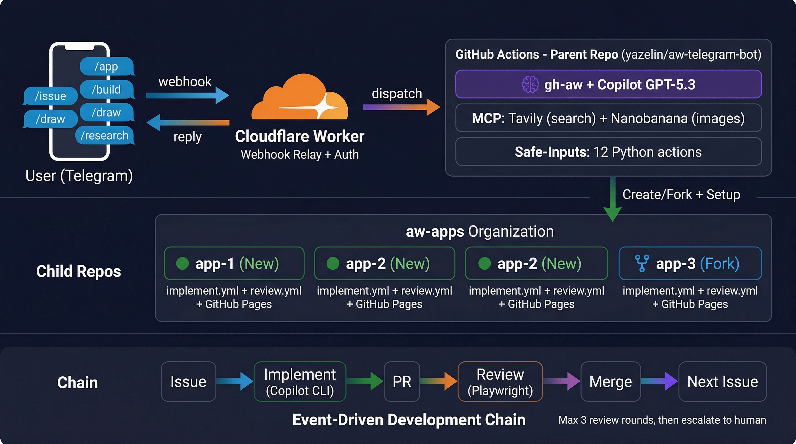
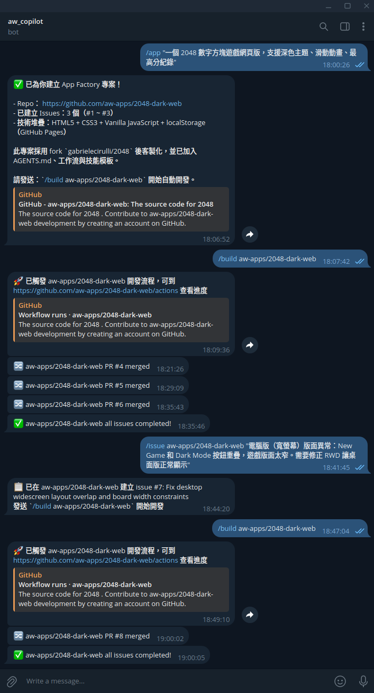

# aw-telegram-bot

透過 [gh-aw](https://github.com/github/gh-aw)（GitHub Agentic Workflows）驅動的個人 Telegram 聊天機器人，以 GitHub Copilot 作為 AI 引擎。除了基本對話，它更是一座 **App Factory** — 只需一則 Telegram 訊息，就能自動建立、開發並部署網頁應用程式。



### 實際運作截圖



## 運作方式

```
你 (Telegram) → Cloudflare Worker → GitHub Actions → Copilot AI → Telegram 回覆
                                          ↓
                                    App Factory 模式
                                          ↓
                              建立/Fork Repo (aw-apps 組織)
                                          ↓
                              規劃 Issues → 實作 → 審查 → 部署
```

1. 傳送訊息給 Telegram 機器人
2. Cloudflare Worker 接收 Webhook，驗證使用者身份，轉發到 GitHub Actions
3. gh-aw 工作流程以 Copilot（GPT-5.3 Codex）作為 AI 引擎執行
4. Copilot 處理請求並回覆 — 或啟動完整的開發流水線

## 指令列表

| 指令 | 說明 | 範例 |
|------|------|------|
| `/app <描述>` | 從零開始建立新的網頁應用 | `/app 番茄鐘計時器網頁` |
| `/app fork:<owner/repo> <描述>` | Fork 現有專案並客製化 | `/app fork:user/repo 加上深色主題` |
| `/build <owner/repo>` | 觸發指定 Repo 的實作流程 | `/build aw-apps/my-app` |
| `/issue <owner/repo> <描述>` | 在指定 Repo 建立結構化 Issue | `/issue aw-apps/my-app 修正 RWD 版面` |
| `/msg <owner/repo>#<N> <文字>` | 在 Issue 或 PR 上留言 | `/msg aw-apps/my-app#3 請加上動畫` |
| `/research <主題>` | 網路研究（多來源搜尋） | `/research React vs Vue 2026` |
| `/draw <描述>` | AI 圖片生成（Gemini） | `/draw 一隻柴犬在太空` |
| `/download <網址>` | 下載 YouTube、X 等平台影片 | `/download https://youtu.be/...` |
| *（無前綴）* | 自動判斷：聊天、翻譯或選擇最佳模式 | `幫我翻譯這段英文` |

## 系統架構

### 元件總覽

```
┌─────────────┐     webhook      ┌──────────────────┐    dispatch     ┌─────────────────────┐
│  Telegram    │ ──────────────→ │  Cloudflare       │ ─────────────→ │  GitHub Actions      │
│  （使用者）   │ ←────────────── │  Worker           │                │  （父 Repo）          │
│              │    機器人回覆     │  - 身份驗證        │                │                      │
└─────────────┘                  │  - 白名單過濾      │                │  gh-aw + Copilot     │
                                 └──────────────────┘                │  + MCP Servers        │
                                                                      │  + Safe-Inputs        │
                                                                      └──────────┬────────────┘
                                                                                 │
                                                              ┌──────────────────┼──────────────────┐
                                                              │                  │                  │
                                                              ▼                  ▼                  ▼
                                                     ┌──────────────┐  ┌──────────────┐  ┌──────────────┐
                                                     │  aw-apps/    │  │  aw-apps/    │  │  aw-apps/    │
                                                     │  app-1       │  │  app-2       │  │  app-3       │
                                                     │ （子 Repo）   │  │ （子 Repo）   │  │  （Fork）     │
                                                     └──────────────┘  └──────────────┘  └──────────────┘
                                                       implement.yml     implement.yml     implement.yml
                                                       review.yml        review.yml        review.yml
                                                       GitHub Pages      GitHub Pages      GitHub Pages
```

### GitHub 組織與 Repo

| Repo | 角色 | 說明 |
|------|------|------|
| `yazelin/aw-telegram-bot` | **父 Repo** | 託管機器人工作流程、App Factory 技能與範本 |
| `aw-apps/*` | **子 Repo** | 自動建立的網頁應用 Repo，各自擁有獨立 CI/CD |

### 環境變數與 Secret 架構

系統的環境變數分佈在四個地方：Cloudflare Worker、父 Repo（GitHub Actions）、子 Repo（自動設定）、MCP 伺服器。

#### Cloudflare Worker

透過 `wrangler secret put` 或 `wrangler.toml` 設定。

| 變數 | 類型 | 用途 |
|------|------|------|
| `TELEGRAM_BOT_TOKEN` | Secret | Telegram Bot API Token，用於註冊 Webhook |
| `TELEGRAM_SECRET` | Secret | Webhook 簽名驗證（`X-Telegram-Bot-Api-Secret-Token` header） |
| `GITHUB_TOKEN` | Secret | 呼叫 GitHub API 觸發父 Repo 工作流程 |
| `GITHUB_OWNER` | Secret | GitHub 帳號或組織名稱（例如 `yazelin`） |
| `GITHUB_REPO` | Secret | 父 Repo 名稱（例如 `aw-telegram-bot`） |
| `ALLOWED_USERS` | Var | 允許使用的 Telegram User ID（逗號分隔） |
| `ALLOWED_CHATS` | Var | 允許使用的 Telegram Chat ID（逗號分隔） |

#### 父 Repo（GitHub Actions Secret）

在 GitHub Repo Settings → Secrets and variables → Actions 中設定。

| Secret | 用途 | Token 類型 |
|--------|------|------------|
| `TELEGRAM_BOT_TOKEN` | 傳送 Telegram 訊息（回覆、通知） | Telegram Bot API Token |
| `GEMINI_API_KEY` | Nanobanana MCP 圖片生成（Google Gemini） | Google AI API Key |
| `TAVILY_API_KEY` | Tavily MCP 網路搜尋與內容擷取 | Tavily API Key |
| `FACTORY_PAT` | 在 `aw-apps` 組織建立 Repo、設定 Secret、觸發工作流程 | Fine-grained PAT（需 `aw-apps` 組織權限） |
| `FORK_TOKEN` | Fork 外部 Repo 至 `aw-apps` 組織 | Classic PAT（需 `public_repo` 權限） |
| `COPILOT_PAT` | 子 Repo 的 Git push、建立 PR、合併、Code Review | Fine-grained PAT |
| `CHILD_COPILOT_TOKEN` | 傳遞至子 Repo 作為 `COPILOT_GITHUB_TOKEN` | Copilot CLI Token |
| `NOTIFY_TOKEN` | 傳遞至子 Repo，用於回呼 `notify.yml` | Fine-grained PAT（需父 Repo `actions:write`） |

#### 子 Repo（自動傳遞）

由 `setup-secrets` Safe-Input 自動從父 Repo 設定至子 Repo，**不需手動設定**。

| Secret（子 Repo） | 來源（父 Repo） | 用途 |
|-------------------|----------------|------|
| `COPILOT_GITHUB_TOKEN` | `CHILD_COPILOT_TOKEN` | Copilot CLI 認證（`implement.yml`、`review.yml`） |
| `COPILOT_PAT` | `COPILOT_PAT` | Git push、建立/合併 PR |
| `NOTIFY_TOKEN` | `NOTIFY_TOKEN` | 完成/失敗時回呼父 Repo 的 `notify.yml` |

#### MCP 伺服器環境變數

在 `telegram-bot.md` 中設定，執行時自動注入。

| 變數 | 值 | 用途 |
|------|----|------|
| `NANOBANANA_GEMINI_API_KEY` | `${{ secrets.GEMINI_API_KEY }}` | Gemini API 認證 |
| `NANOBANANA_MODEL` | `gemini-3-pro-image-preview` | 主要圖片生成模型 |
| `NANOBANANA_FALLBACK_MODELS` | `gemini-3.1-flash-image-preview,gemini-2.5-flash-image` | 備用模型（主模型 503 時切換） |
| `NANOBANANA_TIMEOUT` | `120` | API 請求逾時（秒） |
| `NANOBANANA_OUTPUT_DIR` | `/tmp/nanobanana-output` | 圖片輸出目錄 |
| `NANOBANANA_DEBUG` | `1` | 除錯模式 |

#### Secret 流向圖

```
Cloudflare Worker                     父 Repo (aw-telegram-bot)                子 Repo (aw-apps/*)
┌────────────────────┐               ┌────────────────────────┐              ┌─────────────────────┐
│ TELEGRAM_BOT_TOKEN │               │ TELEGRAM_BOT_TOKEN     │              │                     │
│ TELEGRAM_SECRET    │               │ GEMINI_API_KEY         │              │                     │
│ GITHUB_TOKEN ──────┼── 觸發 ──────→│ TAVILY_API_KEY         │              │                     │
│ GITHUB_OWNER       │               │ FACTORY_PAT ───────────┼── 建 Repo ──→│                     │
│ GITHUB_REPO        │               │ FORK_TOKEN ────────────┼── Fork ─────→│                     │
│ ALLOWED_USERS      │               │ CHILD_COPILOT_TOKEN ───┼── 傳遞 ─────→│ COPILOT_GITHUB_TOKEN│
│ ALLOWED_CHATS      │               │ COPILOT_PAT ───────────┼── 傳遞 ─────→│ COPILOT_PAT         │
└────────────────────┘               │ NOTIFY_TOKEN ──────────┼── 傳遞 ─────→│ NOTIFY_TOKEN ───────┼── 回呼
                                     └────────────────────────┘              └─────────────────────┘
```

## App Factory 流水線

App Factory 是核心功能 — 將一段文字描述轉化為已部署的網頁應用。

### 階段 1：可行性檢查
- 驗證需求是否能以靜態網頁應用實現
- 若需要後端、資料庫或付費 API，則拒絕

### 階段 2：深度研究（發散）
- 搜尋 2-3 個類似的開源專案（雙語搜尋：英文 + 使用者語言）
- 擷取並分析其 README、架構與功能
- **Fork 判斷**：若找到的專案實現了 ≥60% 的需求功能，且為靜態網站 → Fork 它
- 否則 → 從零建立（或作為靈感參考）

### 階段 3：定義驗收標準
- 撰寫清晰、可測試的驗收標準
- 不允許模糊需求 — 每條標準都必須可驗證

### 階段 4：反向規劃（收斂）
- 建立 2-5 個結構化 Issue（不多於 5 個），每個包含：
  - **目標（Objective）** — 這個 Issue 要達成什麼
  - **背景（Context）** — 如何融入整體架構
  - **方法（Approach）** — 逐步實作指引
  - **檔案（Files）** — 需要建立/修改的確切檔案
  - **驗收標準（Acceptance Criteria）** — 完成的勾選清單
  - **驗證方式（Validation）** — 如何確認它能正常運作

### 階段 5：執行
1. 在 `aw-apps` 組織建立（或 Fork）Repo
2. 推送初始檔案：`README.md`、`AGENTS.md`、工作流程、技能文件
3. 在子 Repo 設定 Secret
4. 建立帶有 `copilot-task` 標籤的結構化 Issue
5. 觸發實作工作流程

### 事件驅動開發鏈

```
Issue 建立（copilot-task 標籤）
        │
        ▼
  ┌─────────────┐    PR 開啟      ┌─────────────┐
  │  implement   │ ─────────────→ │   review     │
  │  工作流程     │                │   工作流程    │
  │              │                │              │
  │ Copilot CLI  │ ← 要求修改 ─── │ Copilot CLI  │
  │ --autopilot  │                │ + Playwright │
  │ --yolo       │                │   瀏覽器測試  │
  └──────────────┘                └──────┬───────┘
                                         │
                                    PR 合併
                                         │
                                         ▼
                                  觸發下一個 Issue
                                 （循環直到全部完成）
                                         │
                                         ▼
                                   ✅ 全部完成
                                   透過 Telegram 通知
```

每個循環：**實作 → PR → 審查（+ Playwright 測試）→ 合併 → 下一個 Issue**

若審查發現問題 → 要求修改 → 實作修正 → 再次審查（最多 3 輪）

## MCP 伺服器與工具

| 伺服器 | 用途 | 供應商 |
|--------|------|--------|
| **Tavily** | 網路搜尋、內容擷取、網站爬取 | Tavily API |
| **Nanobanana** | AI 圖片生成（Gemini 3.0 Pro） | Google Gemini |

| 工具 | 用途 |
|------|------|
| `web-fetch` | 擷取並解析網頁 |
| `web-search` | 搜尋網路資訊 |
| Safe-Inputs | 12 個自訂 Python 動作（詳見下方） |

### Safe-Input 動作

| 動作 | 說明 |
|------|------|
| `create-repo` | 建立新的 GitHub Repo |
| `fork-repo` | Fork 外部 Repo 至 aw-apps 組織 |
| `setup-repo` | 推送初始檔案至 Repo |
| `create-issues` | 批次建立結構化 Issue |
| `setup-secrets` | 設定 Repo Secret |
| `trigger-workflow` | 觸發子 Repo 的工作流程 |
| `post-comment` | 在 Issue 或 PR 留言 |
| `manage-labels` | 新增/移除標籤 |
| `send-telegram-message` | 傳送文字至 Telegram |
| `send-telegram-photo` | 傳送圖片至 Telegram |
| `send-telegram-video` | 傳送影片至 Telegram |
| `download-video` | 透過 yt-dlp 下載影片 |

## 子 Repo 結構

App Factory 建立的每個子 Repo 都會包含：

```
<app-name>/
├── .github/
│   ├── workflows/
│   │   ├── implement.yml      # 使用 Copilot CLI 自動實作 Issue
│   │   └── review.yml         # 使用 Playwright 自動審查 PR
│   └── skills/
│       ├── issue-workflow-SKILL.md
│       ├── code-standards-SKILL.md
│       ├── testing-SKILL.md
│       └── deploy-pages-SKILL.md
├── AGENTS.md                   # 專案規格、技術棧、驗收標準
├── README.md                   # 專案文件
├── index.html                  # 進入點
└── （應用程式專屬檔案）
```

### 品質防護機制

- **靜態匯入檢查**：推送前以 `grep` 掃描 bare module imports（必須使用 CDN 或相對路徑）
- **Playwright 瀏覽器測試**：啟動 HTTP 伺服器、開啟頁面、檢查 Console 錯誤
- **審查上限**：最多 3 輪審查，超過則升級為人工處理（`needs-human-review` 標籤）
- **卡住偵測**：實作失敗時加上 `agent-stuck` 標籤 + Telegram 通知

## 專案結構

```
aw-telegram-bot/
├── .github/
│   ├── workflows/
│   │   ├── telegram-bot.md          # 主要 Prompt（由 gh-aw 編譯）
│   │   ├── telegram-bot.lock.yml    # 編譯後的 GitHub Actions 工作流程
│   │   └── notify.yml               # Telegram 通知回呼
│   └── skills/
│       └── app-factory/
│           ├── create_repo.py       # 建立 GitHub Repo
│           ├── fork_repo.py         # Fork 外部 Repo + 啟用 Issues
│           ├── setup_repo.py        # Clone、寫入檔案、推送（自動偵測分支）
│           ├── create_issues.py     # 批次建立 Issue 與標籤
│           ├── setup_secrets.py     # 設定 Repo Secret
│           ├── trigger_workflow.py  # 觸發子 Repo 工作流程
│           ├── post_comment.py      # 在 Issue/PR 留言
│           ├── manage_labels.py     # 新增/移除標籤
│           └── templates/
│               ├── workflows/
│               │   ├── implement.yml    # 子 Repo 實作範本
│               │   └── review.yml       # 子 Repo 審查範本
│               └── skills/
│                   ├── issue-workflow-SKILL.md
│                   ├── code-standards-SKILL.md
│                   ├── testing-SKILL.md
│                   └── deploy-pages-SKILL.md
├── worker/                          # Cloudflare Worker
│   ├── src/index.js                 # Webhook 處理器 + 使用者白名單
│   └── wrangler.toml
├── scripts/
│   └── setup.sh                     # 互動式設定精靈
├── docs/
│   └── plans/                       # v1-v6 設計文件
└── README.md
```

## 設定方式

### 前置需求

- [GitHub CLI](https://cli.github.com/) 搭配 [gh-aw 擴充](https://github.com/github/gh-aw)
- [Wrangler CLI](https://developers.cloudflare.com/workers/wrangler/)（Cloudflare Workers）
- [Telegram Bot](https://core.telegram.org/bots#botfather)（透過 @BotFather 建立）
- GitHub Copilot 訂閱
- 用於子 Repo 的 GitHub 組織（例如 `aw-apps`）

### 快速開始

```bash
./scripts/setup.sh
```

### 手動設定

1. **部署 Cloudflare Worker**
   ```bash
   cd worker && wrangler deploy
   ```

2. **設定 Worker Secret 與變數**
   ```bash
   # Secret（敏感資料）
   wrangler secret put TELEGRAM_BOT_TOKEN
   wrangler secret put TELEGRAM_SECRET
   wrangler secret put GITHUB_TOKEN
   wrangler secret put GITHUB_OWNER
   wrangler secret put GITHUB_REPO
   ```
   在 `wrangler.toml` 中設定白名單：
   ```toml
   [vars]
   ALLOWED_USERS = "你的_Telegram_User_ID"
   ALLOWED_CHATS = ""
   ```

3. **註冊 Telegram Webhook**
   ```
   https://<worker-url>/register?token=<your-TELEGRAM_SECRET>
   ```

4. **設定 GitHub Repo Secret**（父 Repo）
   ```bash
   # Telegram
   gh secret set TELEGRAM_BOT_TOKEN       # Telegram Bot API Token

   # AI 服務
   gh secret set GEMINI_API_KEY            # Google Gemini（圖片生成）
   gh secret set TAVILY_API_KEY            # Tavily（網路搜尋）

   # App Factory — Repo 管理
   gh secret set FACTORY_PAT              # aw-apps 組織的 Fine-grained PAT
   gh secret set FORK_TOKEN               # Classic PAT（需 public_repo 權限，用於 Fork）

   # App Factory — 子 Repo 自動化
   gh secret set CHILD_COPILOT_TOKEN      # 傳遞至子 Repo 作為 COPILOT_GITHUB_TOKEN
   gh secret set COPILOT_PAT              # 子 Repo 的 Git 操作與 PR 管理
   gh secret set NOTIFY_TOKEN             # 子 Repo 回呼通知的 PAT
   ```

5. **編譯並推送**
   ```bash
   gh aw compile
   git push
   ```

## 開發歷程

> 完整系列文章：[aw-telegram-bot 系列目錄](https://yazelin.github.io/2026/03/04/aw-telegram-bot-series-index/)

| 版本 | 功能 | 主要變更 | Blog |
|------|------|----------|------|
| v1 | 基本聊天 | Telegram ↔ Copilot 對話 | [踩了 6 個坑才走通](https://yazelin.github.io/2026/03/03/aw-telegram-bot-v1-basic-chatbot/) |
| v2 | 圖片生成 | Nanobanana + Gemini 整合 | [踩了 Docker container 的坑](https://yazelin.github.io/2026/03/03/aw-telegram-bot-v2-image-generation/) |
| v3 | 研究模式 | Tavily 搜尋 + web-fetch | [踩了 concurrency 的坑](https://yazelin.github.io/2026/03/03/aw-telegram-bot-v3-research-mode/) |
| v4 | 影片下載 | yt-dlp 影片下載 | [影片下載 + 使用者白名單](https://yazelin.github.io/2026/03/04/aw-telegram-bot-v4-video-download/) |
| v5 | App Factory | 端到端 Repo 建立 + 自動化開發 | [用 Telegram 指令讓 AI 自動建網站](https://yazelin.github.io/2026/03/04/aw-telegram-bot-v5-app-factory/) |
| v6 | 智慧規劃 | Fork 支援、結構化 Issue、Playwright 測試、`/issue` 指令 | [省一半 Premium Request](https://yazelin.github.io/2026/03/04/aw-telegram-bot-v6-smart-planning/) |

## 授權

MIT
